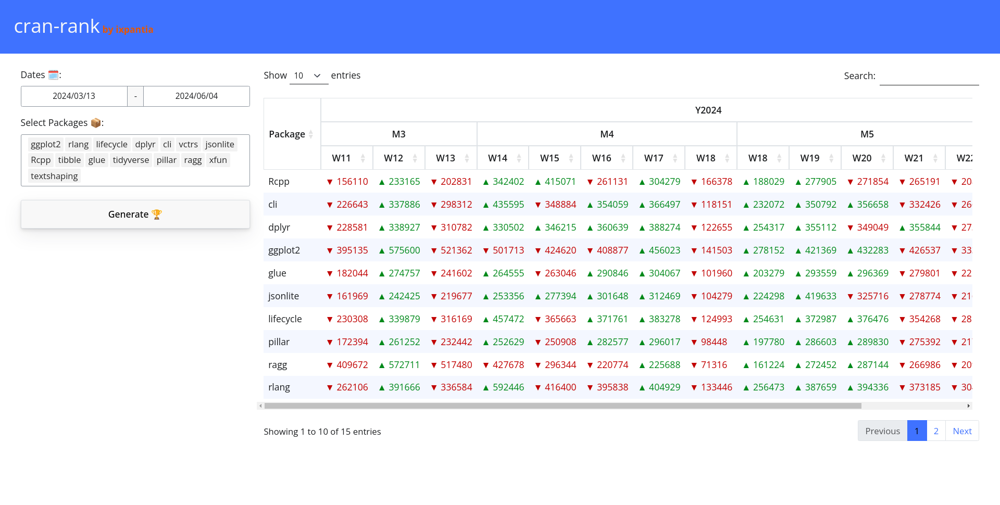

# cran-rank

This [ixpantia](https://www.ixpantia.com/en/) submission for the 2024
[Posit Table Contest](https://posit.co/blog/announcing-the-2024-table-contest/).

## What's unique about this table

This table show cases a unique dynamic header that groups weeks, months and
years into merged cells. This makes for a beautiful and easy to read table. It
also includes a running comparison between entries across time.

## How we built the header

The header is built by representing repeating values in a matrix. This
matrix gets wrapped in the [`ContainerBuilder`](https://github.com/ixpantia/cran-rank/blob/main/src/R/container.R)
class which includes methods for detecting the `colspan` and other
attributes of the header. This class then builds the header into
an HTML string that can be then used alongside the [DT](https://rstudio.github.io/DT/)
package.

## How we made the colored text difference

The color text difference is powered by a very minimal package called
[redgreen](https://github.com/ixpantia/redgreen). This package simply
makes a "vectorized" string interpolation based on the data passed on to
the `redgreen` function.
